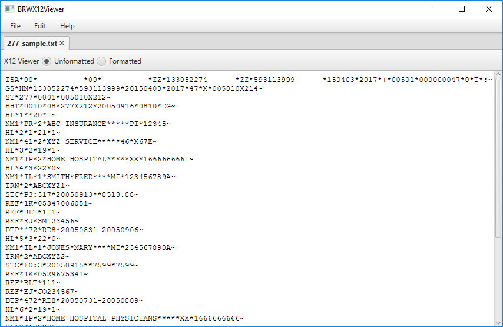

## BRWX12Viewer
### X12 Data Viewer

View X12 data as unformatted text or as a formatted HTML page. 

Formatted HTML pages are generated based on a configuration that associates an X12 type (such as 277 - claim status response) with an X12Schema and an XSLT file.

This project has a dependency on BRWX12Library, which is available on GitHub.

X12Schema and XSLT files can be found on GitHub at BRWX12Transform.

Sample X12 data file can be found [here](./samples/277_sample.txt).

Sample configuration can be found [here](./samples/config_sample.xml).

Note: The configuration can be imported into the viewer, but it will first need to be manually modified to reflect your own file system.
 
### Features

* Open multiple files
* Save As unformatted/formatted
* Print
* Copy to clipboard
* Search text

### Screenshots

**Unformatted X12 Data**

**Formatted X12 Data**

**Configuration**

Configurations can be implementation specific or generic for the TSID.

